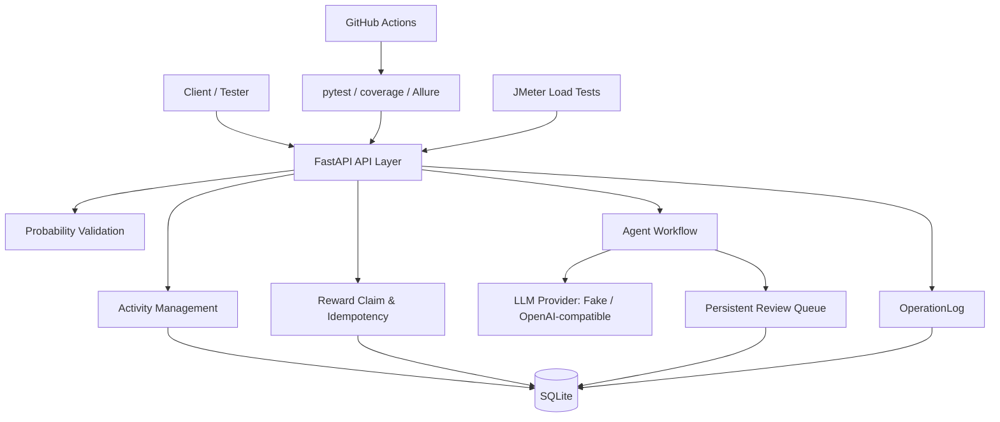

# GameOps Agent Test Platform

一个面向测试开发 / SDET 实习作品集的游戏运营活动配置、奖励领取、Agent 审核、自动化测试与压测平台。

> 当前项目是 portfolio/demo，不声称生产级；重点展示服务端质量保障、自动化测试、可追溯性、Agent 工作流测试和性能测试方案。

## 项目背景

游戏运营活动常见质量风险包括：活动状态配置错误、重复发奖、奖池扣减异常、掉率配置错误、高风险 Agent 输出自动落库、审核记录丢失和操作不可追溯。本项目围绕这些风险实现一套可运行、可测试、可展示的后端质量保障平台。

## 技术栈

- Python 3.9+
- FastAPI / Uvicorn
- SQLAlchemy / SQLite
- Pydantic
- pytest / pytest-cov / Allure Pytest
- JMeter
- Docker / Docker Compose
- GitHub Actions
- Mermaid 文档图

## 系统架构



## 核心功能

- Activity Management：活动创建、查询、发布、回滚。
- Reward Claim & Idempotency：钱包、奖池、奖励流水、daily limit、idempotency_key。
- Probability Validation：掉率规则校验、Monte Carlo 模拟、保底 warning。
- Agent Workflow：FakeLLMProvider、OpenAI-compatible 扩展点、工具调用、风险判断。
- Review Queue：高风险配置持久化待审，`/admin/reviews` 简单审核页。
- OperationLog：记录活动、领奖、概率校验、Agent 生成、审核动作等关键操作。
- pytest / coverage / Allure：129 条自动化测试，coverage HTML 和 Allure results。
- JMeter：4 类核心接口压测计划、CSV 数据、运行脚本和 HTML 报告输出。

## 快速开始

### 本地 Python 启动

```powershell
python -m venv .venv
.\.venv\Scripts\Activate.ps1
python -m pip install -e .
uvicorn app.main:app --reload
```

访问：

```text
http://127.0.0.1:8000/docs
```

健康检查：

```powershell
curl http://127.0.0.1:8000/api/health
```

### Docker 启动

```powershell
docker build -t gameops-agent-test-platform .
docker run -p 8000:8000 gameops-agent-test-platform
```

或：

```powershell
docker compose up --build
```

当前 Docker 默认使用容器内 SQLite，适合演示。真实压测或生产化建议切换 MySQL/PostgreSQL，并引入 Redis 等基础设施。

## API 文档入口

- Swagger UI: `http://127.0.0.1:8000/docs`
- Review Queue 页面: `http://127.0.0.1:8000/admin/reviews`

详细 API 文档见：

```text
docs/api_overview.md
```

## 测试

运行全部测试：

```powershell
python -m pytest -q
```

或：

```powershell
.\scripts\run_tests.ps1
```

运行 coverage：

```powershell
python -m pytest --cov=app --cov-report=term-missing --cov-report=html
```

打开：

```text
htmlcov/index.html
```

生成 Allure results：

```powershell
python -m pytest --alluredir=reports/allure-results
```

如果本机安装了 Allure CLI：

```powershell
allure serve reports/allure-results
```

测试策略见：

```text
docs/testing_strategy.md
```

## 性能测试

JMeter 压测计划：

- `jmeter/activity_create_load_test.jmx`
- `jmeter/reward_claim_load_test.jmx`
- `jmeter/agent_generate_load_test.jmx`
- `jmeter/probability_validate_load_test.jmx`

Windows：

```powershell
.\scripts\run_jmeter_activity.ps1
.\scripts\run_jmeter_reward.ps1
.\scripts\run_jmeter_agent.ps1
.\scripts\run_jmeter_probability.ps1
```

报告路径：

```text
reports/jmeter/*_html/index.html
```

性能测试说明见：

```text
docs/performance_testing.md
```

## CI

GitHub Actions 工作流：

```text
.github/workflows/ci.yml
```

CI 在 push / pull_request 时执行：

1. 安装 Python 3.11
2. `pip install -e .`
3. `python -m pytest -q`
4. coverage 运行并上传 `htmlcov`
5. 生成 Allure results 并上传 artifact

CI 使用 `LLM_PROVIDER=fake`，不依赖网络、不需要真实 LLM API Key，也不运行 JMeter。

## 关键业务风险与测试覆盖

- 重复发奖：idempotency_key + RewardRecord 测试。
- 奖池重复扣减：重复 key 下钱包和奖池金额不变。
- 非法活动状态：draft/published/rolled_back 状态流转测试。
- 概率异常：概率边界、tolerance、保底 warning、Monte Carlo 稳定性测试。
- 高风险 Agent 自动落库：pending_review + approve/reject 测试。
- 危险指令：中英文 Guardrail 拦截测试。
- 审核记录丢失：AgentReviewRecord 持久化和 Review Queue 测试。
- 审计日志缺失：OperationLog API、过滤和清理测试。

## 项目截图占位符

- `/docs` API screenshot
- Allure report screenshot
- Coverage report screenshot
- JMeter report screenshot
- Review Queue screenshot

## 文档

- `docs/project_overview.md`
- `docs/api_overview.md`
- `docs/testing_strategy.md`
- `docs/performance_testing.md`
- `docs/interview_notes.md`
- `docs/resume_bullets.md`

## 当前局限

- SQLite 适合本地演示，不适合真实高并发写入。
- OpenAICompatibleProvider 只保留扩展点，测试默认使用 FakeLLMProvider。
- Review Queue 是简单 HTML 页面，不是复杂 Dashboard。
- JMeter 计划用于展示性能测试方法，真实压测建议接 MySQL/PostgreSQL 和监控。

## Roadmap

- Unity Client Demo
- Dashboard
- MySQL / Redis
- Real LLM Provider
- JMeter real report screenshots
- CI performance smoke test

## Resume Bullets

- 使用 pytest 构建覆盖活动配置、奖励领取、幂等校验、概率校验、Agent 风控与审计日志的自动化测试体系，结合 pytest-cov 输出覆盖率报告，并通过 Allure 生成可视化测试报告。
- 使用 JMeter 构建活动创建、奖励领取、Agent 生成与概率校验接口的性能测试方案，分析吞吐量、错误率、平均响应时间与 P95/P99 延迟。
- 设计 FakeLLMProvider + OpenAI-compatible Provider 架构，实现 Guardrail、Human-in-the-loop 和持久化 Review Queue，防止高风险 Agent 输出自动落库。
