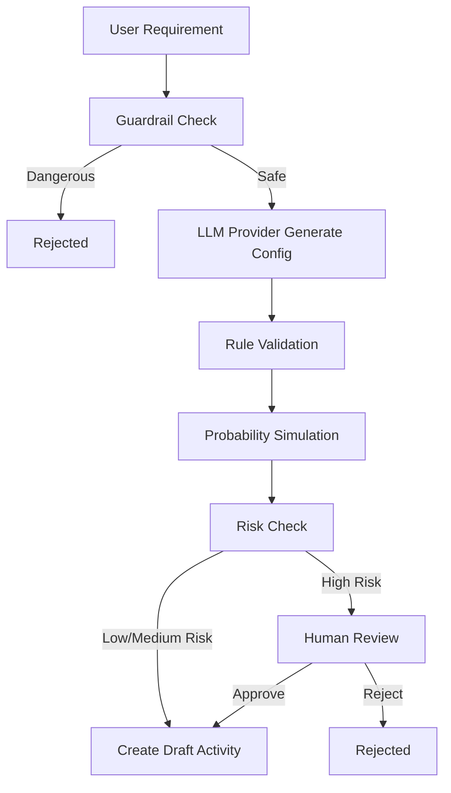

# gameops-agent-test-platform

## 项目背景

`gameops-agent-test-platform` 是一个面向测试开发 / SDET 实习简历展示的后端项目。项目核心场景是“游戏运营活动配置与质量保障平台”，用于逐步沉淀活动配置、质量校验、接口测试、性能测试与测试报告能力。

当前已完成 Day 1 到 Day 3：

- Day 1：FastAPI 基础服务、健康检查、统一响应结构和基础测试。
- Day 2：活动配置 API，支持创建、查询、列表、发布和回滚。
- Day 3：奖励领取、用户钱包、奖励流水、幂等校验和 daily limit 校验。
- Day 4：掉落概率规则校验、Monte Carlo 模拟和保底规则提示。
- Day 5：Agent 工作流、LLM Provider 架构、风险拦截和人工审核。
- Day 6：Agent Review 持久化、统一操作审计日志和日志保留策略。
- Day 7：pytest 自动化测试体系、coverage 覆盖率报告、Allure 测试报告和测试运行脚本。

暂未实现 Agent、JMeter、Docker、CI 等后续功能。

## 技术栈

- Python 3.9+
- FastAPI
- Uvicorn
- Pydantic
- SQLAlchemy
- SQLite
- Pytest
- Pytest-Cov
- HTTPX
- Allure Pytest

## 本地启动方式

创建并激活虚拟环境：

```bash
python -m venv .venv
.venv\Scripts\activate
```

安装依赖：

```bash
python -m pip install -e .
```

启动服务：

```bash
uvicorn app.main:app --reload
```

健康检查：

```bash
curl http://127.0.0.1:8000/api/health
```

期望返回：

```json
{
  "code": 0,
  "message": "success",
  "data": {
    "status": "ok"
  }
}
```

## 测试运行方式

运行全部测试：

```bash
python -m pytest -q
```

运行覆盖率测试：

```bash
python -m pytest --cov=app
```

## Day 7 测试体系

Day 7 将项目从“功能能跑”整理为“测试体系可展示”的状态，补充了 pytest markers、公共 fixtures、coverage 配置、Allure 标注、测试运行脚本和测试策略文档。

测试策略文档：

```text
docs/testing_strategy.md
```

### 运行全部测试

Windows:

```powershell
python -m pytest -q
```

或：

```powershell
.\scripts\run_tests.ps1
```

### 运行覆盖率

```powershell
python -m pytest --cov=app --cov-report=term-missing --cov-report=html
```

或：

```powershell
.\scripts\run_coverage.ps1
```

生成后打开：

```text
htmlcov/index.html
```

### 生成 Allure 报告

```powershell
python -m pytest --alluredir=reports/allure-results
```

如果本机已安装 Allure CLI：

```powershell
allure serve reports/allure-results
```

或：

```powershell
.\scripts\run_allure.ps1
```

`reports/allure-results/` 和 `reports/allure-report/` 已加入 `.gitignore`，不会提交实际报告文件。

### pytest markers

当前配置的测试分类：

- `unit`：服务层 / 单元测试
- `api`：接口测试
- `integration`：跨模块流程测试
- `regression`：回归场景测试
- `agent`：Agent 工作流与 Guardrail 测试
- `performance`：性能相关测试占位，不包含 JMeter

示例：

```powershell
python -m pytest -m api
python -m pytest -m agent
```

### 当前覆盖的核心风险

- 重复请求不重复发奖
- 奖池扣减与钱包增加一致
- 活动状态非法流转被拦截
- 概率配置边界错误被识别
- 高风险 Agent 输出不会直接落库
- 危险指令会被 Guardrail 拦截
- pending review 持久化，不因服务 reload 丢失
- OperationLog 记录关键操作留痕

## 简历 Bullet 补充 4

- 使用 pytest 构建覆盖活动配置、奖励领取、幂等校验、概率校验、Agent 风控与审计日志的自动化测试体系，结合 pytest-cov 输出覆盖率报告，并通过 Allure 生成可视化测试报告。
- 设计接口层、服务层与集成回归测试，覆盖重复请求不重复发奖、奖池扣减一致性、高风险 Agent 审核、危险指令拦截和 OperationLog 留痕等核心质量风险。

## 活动配置模块

Day 2 新增游戏运营活动配置 API，支持活动创建、查询、列表、发布和回滚。当前模块处理活动配置生命周期，不包含奖励领取之外的后续测试平台能力。

活动状态：

- `draft`：草稿，活动创建后的默认状态。
- `published`：已发布，允许玩家领取奖励。
- `rolled_back`：已回滚，不允许继续领取奖励。

本地开发默认使用 SQLite，数据库文件为项目根目录下的 `gameops.db`。

### Day 2 API

- `POST /api/activities`：创建活动
- `GET /api/activities/{activity_id}`：查询单个活动
- `GET /api/activities`：查询活动列表
- `POST /api/activities/{activity_id}/publish`：发布活动
- `POST /api/activities/{activity_id}/rollback`：回滚活动

创建活动示例：

```bash
curl -X POST http://127.0.0.1:8000/api/activities \
  -H "Content-Type: application/json" \
  -d '{
    "name": "Spring Festival Login Event",
    "start_time": "2026-06-01T00:00:00",
    "end_time": "2026-06-10T23:59:59",
    "reward_pool_gold": 10000,
    "reward_pool_diamond": 500,
    "drop_item_id": "item_1001",
    "drop_probability": 0.25,
    "daily_limit": 3,
    "pity_threshold": 10,
    "risk_level": "low"
  }'
```

## 奖励领取模块

Day 3 新增奖励领取模块，覆盖用户钱包、奖励流水、奖池扣减、daily limit 和幂等校验。

领取规则：

- 只有 `published` 状态活动可以领取。
- 当前时间必须在活动 `start_time` 和 `end_time` 之间。
- 同一用户同一活动当天成功领取次数不能超过 `daily_limit`。
- 奖池不足时拒绝领取。
- 首次领取成功后，活动奖池扣减、用户钱包增加、奖励流水写入在同一个数据库事务中完成。

### 幂等 Key 设计

客户端调用 `POST /api/rewards/claim` 时必须传入 `idempotency_key`。该 key 在 `RewardRecord` 中唯一。

- 第一次请求成功：写入奖励流水，返回 `duplicated=false`。
- 相同 `idempotency_key` 重复请求：不会重复扣奖池、不会重复加钱包，返回第一次领取结果并标记 `duplicated=true`。

### 一致性说明

奖励领取成功时会在同一个 SQLAlchemy session 事务中完成：

- `Activity.reward_pool_gold` 扣减固定奖励金币。
- `UserWallet.gold` 增加固定奖励金币。
- `RewardRecord` 写入成功流水。

如果过程中出现业务错误或数据库异常，会执行 rollback，避免奖池、钱包和流水出现部分成功。

### Day 3 API

- `POST /api/rewards/claim`：领取奖励
- `GET /api/users/{user_id}/wallet`：查询用户钱包，不存在时返回零余额钱包
- `GET /api/rewards/records`：查询奖励流水列表

领取奖励示例：

```bash
curl -X POST http://127.0.0.1:8000/api/rewards/claim \
  -H "Content-Type: application/json" \
  -d '{
    "user_id": "user_001",
    "activity_id": 1,
    "idempotency_key": "claim-user-001-activity-1-001"
  }'
```

## 简历 Bullet 初稿

- 设计并实现基于 FastAPI + SQLAlchemy 的游戏运营活动配置与奖励领取后端服务，覆盖活动发布、回滚、钱包发奖、奖池扣减和奖励流水追踪。
- 引入 `idempotency_key` 幂等机制，防止客户端重试导致重复发奖，并通过 pytest 验证重复请求下钱包与奖池金额保持一致。
- 构建接口级自动化测试，覆盖活动配置校验、状态流转、奖励领取限制、异常路径和 Windows 下 SQLite 测试数据库隔离问题。

## 概率校验模块

Day 4 新增游戏掉落概率校验工具，用于发现活动配置中的掉率边界错误、模拟偏差风险和保底规则缺失问题。该模块不依赖数据库，也不修改活动或奖励领取链路。

校验能力：

- `probability` 必须在 `[0, 1]` 范围内。
- `sample_size` 必须大于 0。
- `tolerance` 必须大于 0。
- `pity_threshold` 如果存在，必须大于 0。
- 低概率且没有保底阈值时返回 warning。
- `probability=0` 且配置了保底阈值时返回 warning，提示保底是唯一获得途径，需要重点审核。

### Monte Carlo 模拟说明

接口会根据传入的 `probability`、`sample_size` 和 `seed` 进行 Monte Carlo 模拟，返回实际掉率、期望掉率、偏差值和是否通过容忍度检查。

固定 `seed` 用于保证自动化测试和本地复现稳定。`probability=0` 时实际掉率固定为 `0`，`probability=1` 时实际掉率固定为 `1`。

### Day 4 API

- `POST /api/tools/probability/validate`：校验掉落概率配置并返回模拟结果

概率校验示例：

```bash
curl -X POST http://127.0.0.1:8000/api/tools/probability/validate \
  -H "Content-Type: application/json" \
  -d '{
    "probability": 0.2,
    "sample_size": 100000,
    "tolerance": 0.01,
    "seed": 42,
    "pity_threshold": 20
  }'
```

返回示例：

```json
{
  "code": 0,
  "message": "success",
  "data": {
    "expected_probability": 0.2,
    "actual_probability": 0.20156,
    "deviation": 0.00156,
    "sample_size": 100000,
    "tolerance": 0.01,
    "pass": true,
    "warnings": []
  }
}
```

## 简历 Bullet 补充

- 实现游戏掉落概率校验工具，结合规则校验与 Monte Carlo 模拟输出结构化结果，覆盖掉率边界、样本量、容忍度和保底阈值风险。
- 使用固定随机种子保证概率模拟测试可复现，并通过 pytest 覆盖边界概率、低概率 warning、保底规则和 API 统一响应。

## Agent 工作流模块

Day 5 新增 Agent 工作流，用于把运营自然语言需求转成活动配置草稿，并串联规则校验、概率模拟、预算风控、危险指令拦截和 Human-in-the-loop 人工审核。

工作流不会自动发布活动。低/中风险需求会创建 `draft` 活动，高风险需求进入 `pending_review`，危险指令会直接 `rejected`。



### LLM Provider 架构

Agent 依赖 `BaseLLMProvider` 抽象，而不是直接依赖 FakeLLM。

默认模式：

```bash
LLM_PROVIDER=fake
```

可选真实 LLM 模式：

```bash
LLM_PROVIDER=openai
LLM_API_KEY=your_api_key
LLM_BASE_URL=https://api.openai.com/v1
LLM_MODEL=gpt-4o-mini
```

当前项目测试环境永远使用 `FakeLLMProvider`，避免测试依赖网络和 API Key。`OpenAICompatibleProvider` 作为工程扩展点保留，用于展示项目具备接入真实模型的能力；如果缺少 `LLM_API_KEY`，会抛出清晰错误。

### FakeLLMProvider 设计

`FakeLLMProvider` 不调用外部 API，输出稳定，便于 pytest 验证。它会根据关键词生成活动配置，例如：

- “周末世界Boss / 世界BOSS”生成 `weekend_boss_event`。
- “金币预算1000000”生成金币奖池。
- “掉落概率20% / 掉率20%”生成 `drop_probability=0.2`。
- “每天最多领取3次”生成 `daily_limit=3`。
- 高预算、高掉率或钻石奖励会标记为 `risk_level=high`。

### Guardrail 危险指令拦截

以下危险词会直接 rejected，不进入配置生成：

- 中文：`直接执行SQL`、`执行SQL`、`绕过审核`、`无限奖励`、`删除数据库`
- 英文：`drop table`、`bypass review`、`unlimited reward`、`delete database`

### Human-in-the-loop 人工审核

以下情况进入 `pending_review`：

- `risk_level=high`
- `reward_pool_gold > 1000000`
- `drop_probability > 0.5`
- `reward_pool_diamond > 0`
- 概率模拟未通过 tolerance

pending review 会保存在内存 review store 中。`approve` 后创建 `draft` 活动，`reject` 后不创建活动。当前阶段不持久化 review store，pytest 会自动清理，避免测试污染。

### Day 5 API

- `POST /api/agent/generate_activity`：从自然语言需求生成活动草稿或进入审核
- `POST /api/agent/review/{review_id}`：人工审核 approve / reject

生成活动示例：

```bash
curl -X POST http://127.0.0.1:8000/api/agent/generate_activity \
  -H "Content-Type: application/json" \
  -d '{
    "requirement": "创建一个周末世界Boss活动，掉落概率20%，每人每天最多领取3次，总金币预算1000000"
  }'
```

审核示例：

```bash
curl -X POST http://127.0.0.1:8000/api/agent/review/review_xxx \
  -H "Content-Type: application/json" \
  -d '{
    "action": "approve"
  }'
```

## 简历 Bullet 补充 2

- 设计可扩展 LLM Provider 架构，默认使用 FakeLLM 保证测试稳定，同时预留 OpenAI-compatible Provider 作为真实模型接入扩展点。
- 实现运营活动 Agent 工作流，将自然语言需求转成活动配置，并串联规则校验、概率模拟、预算风控、危险指令拦截与人工审核。
- 构建 Human-in-the-loop 审核机制，高风险配置进入 pending review，人工 approve 后才创建 draft 活动，避免高风险活动自动落库。

## 操作审计与可追溯性

Day 6 将 Agent pending review 从内存字典升级为数据库持久化记录，并新增统一 `OperationLog` 表。这样服务 reload 后，只要本地 SQLite 数据库文件没有删除，pending review 仍然可以查询和继续 approve / reject。

### Review Queue 设计

高风险 Agent 需求会进入 Review Queue。用户不需要复制或记住 `review_id`，可以通过 API 或管理页面查看所有待审核任务：

```bash
curl http://127.0.0.1:8000/api/agent/reviews
```

`GET /api/agent/reviews` 默认只返回 `pending` 记录：

```json
{
  "code": 0,
  "message": "success",
  "data": {
    "items": [],
    "total": 0
  }
}
```

支持的 `status`：

- `pending`：默认值，只显示待审核任务
- `approved`：只显示已通过记录
- `rejected`：只显示已拒绝记录
- `all`：显示全部记录

Approve / Reject 后，记录不会删除，只会更新状态、写入 `reviewed_at`，并从默认 pending queue 中隐藏。后台数据库和 OperationLog 会长期保留操作留痕。

### Agent Review 持久化

`AgentReviewRecord` 用于保存高风险 Agent 配置审核记录：

- `review_id`：审核单唯一标识
- `status`：`pending` / `approved` / `rejected`
- `config_json`：待审核活动配置
- `probability_result_json`：概率模拟结果
- `activity_id`：审核通过后创建的 draft activity
- `created_at` / `updated_at` / `reviewed_at`：生命周期时间

### OperationLog 表设计

`OperationLog` 用于记录关键操作，便于追踪问题和复现缺陷：

- `operation_type`：例如 `activity.create`、`reward.claim`、`agent.review.approve`
- `target_type`：例如 `activity`、`reward`、`probability`、`agent_review`
- `target_id`：活动 ID、review ID 或幂等 key
- `actor`：默认 `system`，后续可扩展为用户、Agent 或 Unity 客户端
- `status`：`success` / `failed` / `rejected` / `pending_review`
- `message`：补充说明
- `created_at`：记录时间

已接入的关键操作：

- 活动：创建、发布、回滚
- 奖励：领取成功、重复幂等请求
- 概率：概率校验
- Agent：普通生成、pending review、危险指令拦截、approve、reject

### 日志保留策略

默认保留 365 天：

```bash
OPERATION_LOG_RETENTION_DAYS=365
ENABLE_OPERATION_LOG=true
```

如果需要保留半年：

```bash
OPERATION_LOG_RETENTION_DAYS=180
```

关闭操作日志：

```bash
ENABLE_OPERATION_LOG=false
```

日志清理接口会删除超过保留天数的记录。日志写入失败不会阻断主业务流程。

### Day 6 API

- `GET /api/agent/reviews`：查询 review 列表，支持 `status` 和 `limit`
- `GET /api/agent/reviews/{review_id}`：查询单个 review
- `POST /api/agent/review/{review_id}`：审核 pending review，支持 `approve` / `reject`
- `GET /admin/reviews`：简单 HTML 审核页面，默认展示 pending review
- `GET /admin/reviews/history`：简单 HTML 历史页面，展示最近 approved / rejected 记录
- `GET /api/operation-logs`：查询操作日志，支持 `operation_type`、`target_type`、`actor`、`limit`
- `POST /api/operation-logs/cleanup`：按保留天数清理过期日志

查询 pending review：

```bash
curl http://127.0.0.1:8000/api/agent/reviews?status=pending
```

打开审核页面：

```bash
http://127.0.0.1:8000/admin/reviews
```

页面会展示所有 pending review，包括 `review_id`、审核原因、活动名称、金币奖池、钻石奖池、掉率、daily limit、风险等级、概率模拟是否通过和创建时间。点击 Approve 或 Reject 后，会调用审核 API 并刷新页面。

查询操作日志：

```bash
curl http://127.0.0.1:8000/api/operation-logs?operation_type=agent.review.pending
```

清理过期日志：

```bash
curl -X POST http://127.0.0.1:8000/api/operation-logs/cleanup \
  -H "Content-Type: application/json" \
  -d '{
    "retention_days": 365
  }'
```

### 为什么测试平台需要操作记录

- 便于定位问题：快速找到某个活动、领奖或 Agent 决策的操作链路。
- 便于复现缺陷：保留关键请求、响应摘要和状态。
- 便于追踪 Agent 高风险决策：查看 pending review 的原因和审核结果。
- 便于验证幂等和数据一致性：确认重复请求是否只记录为 `reward.claim.duplicate`，不会重复发奖。

## 简历 Bullet 补充 3

- 将 Agent pending review 从内存存储升级为数据库持久化审核记录，支持服务重启后继续查询、审批和拒绝高风险配置。
- 设计统一 OperationLog 审计表，覆盖活动配置、奖励领取、概率校验、Agent 生成、风控拦截和人工审核等关键操作。
- 实现日志保留策略与清理接口，支持通过环境变量配置保留天数，并通过 pytest 验证审计查询、过滤和过期清理逻辑。
