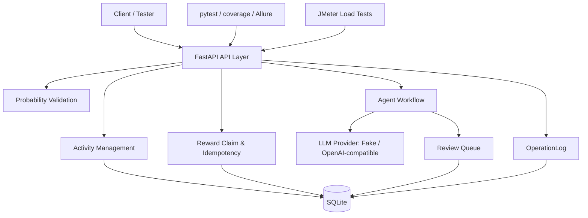

# Project Overview

## 1. 项目背景

GameOps Agent Test Platform 是一个面向测试开发 / SDET 实习作品集的后端项目。它模拟游戏运营活动配置、奖励领取、掉率校验、Agent 风控审核、操作审计和测试报告体系。

项目不是生产级系统，而是按真实质量保障链路设计的 portfolio/demo 项目。

## 2. 项目目标

- 展示后端 API 自动化测试能力。
- 展示幂等、状态流转、数据一致性等质量风险建模。
- 展示 Agent 工作流测试、Guardrail 和 Human-in-the-loop 审核。
- 展示 pytest、coverage、Allure、JMeter、Docker 和 CI 工程化交付。

## 3. 适用岗位

- 测试开发实习
- SDET Intern
- 游戏测试开发
- 服务端质量保障
- AI 应用测试

## 4. 系统架构

## 5. 核心模块

- Activity Management: 活动创建、查询、发布、回滚。
- Reward Claim & Idempotency: 钱包、奖池、奖励流水和幂等校验。
- Probability Validation: 规则校验和 Monte Carlo 模拟。
- Agent Workflow: 自然语言生成活动配置，接入工具校验和风险判断。
- Review Queue: 高风险配置持久化待审，approve 后创建 draft activity。
- OperationLog: 记录关键操作，用于问题复现和审计。
- pytest / coverage / Allure: 自动化测试和报告体系。
- JMeter performance testing: 核心接口压测计划和报告输出。

## 6. 数据流

### 活动创建

用户提交活动配置 -> Pydantic 校验 -> Activity 写入数据库 -> OperationLog 记录 `activity.create`。

### 奖励领取

用户提交 user_id、activity_id、idempotency_key -> 校验活动状态和时间窗口 -> 检查 daily_limit 和奖池 -> 钱包增加、奖池扣减、RewardRecord 写入 -> OperationLog 记录。

### Agent 高风险审核

自然语言需求 -> Guardrail -> FakeLLMProvider 生成配置 -> 活动规则校验 -> 概率模拟 -> 风险判断 -> 高风险写入 AgentReviewRecord -> 审核通过后创建 draft activity。

### OperationLog 留痕

Activity、Reward、Probability、Agent 和 Review 关键操作都会写 OperationLog，便于复现问题和说明质量保障链路。

## 7. 技术栈

- Python 3.9+
- FastAPI
- SQLAlchemy
- SQLite
- Pydantic
- pytest / pytest-cov
- Allure Pytest
- JMeter
- Docker
- GitHub Actions

## 8. 当前局限

- SQLite 适合本地演示，不适合真实高并发写入。
- OpenAICompatibleProvider 只保留扩展点，测试默认使用 FakeLLM。
- JMeter 计划用于展示性能测试方法，不包含真实生产级压测环境。
- 暂无前端 Dashboard，仅提供简单 Review Queue HTML 页面。

## 9. 后续计划

- Unity Client Demo
- Dashboard
- MySQL/Redis
- Real LLM Provider
- JMeter real report screenshots
- CI performance smoke test
